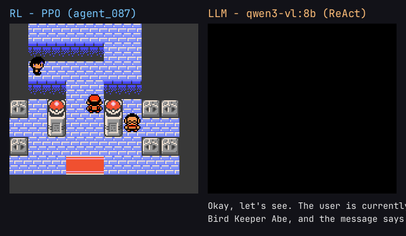

# Pokemon Silver Gym — RL agent vs LLM agent

Two agents, one task: from the start of the game, walk across Johto to the Violet City Gym and beat
Gym Leader **Falkner** for the **Zephyr Badge** in **Pokémon Silver**. One agent is a **PPO
reinforcement-learning agent** trained from pixels; the other is a **local vision-LLM agent**
(`qwen3-vl:8b` via Ollama) that reasons about the screen and calls tools. They share the exact same
Game Boy environment, so the comparison is apples-to-apples: *learning by trial-and-error* against
*reasoning about the goal*.



**The result:** the RL agent solves the overworld navigation the LLM cannot. From the New Bark start,
the trained policy reaches the Violet Gym in about **95% of episodes**; the LLM, after five iterations
of tool and harness work, gets about a third of the way (Route 30) before dynamic obstacles stall it.
The full story — including what it took to get there and where each agent still falls short — is in
[`EXPERIMENTS.md`](EXPERIMENTS.md).

---

## Try it

Bring your own **legal** Pokémon Silver ROM as `pokemon_rom.gbc` (it is not distributable, so it is
never bundled — you mount it at runtime). You need Docker.

**RL agent** — watch the trained agent play (CPU-only, no model server):

```bash
docker compose run --rm rl-agent
```

It loads the pretrained gym agent from inside the Violet City Gym, climbs to Falkner, beats the two
bird-keepers and Falkner, and prints the badge line — typically within ~840 steps.

**LLM agent** — watch the local vision-LLM walk the New Bark → Violet corridor:

```bash
docker compose up -d ollama          # start the local model server
docker compose run --rm ollama-pull  # pull qwen3-vl:8b once (a few GB)
docker compose run --rm llm-agent
```

The LLM is much faster with a GPU — see the commented `deploy` block in `docker-compose.yml`.

---

## What this project shows

- A custom **Gymnasium environment** built from a Game Boy ROM via PyBoy.
- Reading the emulator's **RAM** (empirically verified addresses) for state extraction and reward shaping.
- Training a **PPO agent** (Stable Baselines3) with parallel environments and TensorBoard.
- A **Go-Explore frontier archive** to manufacture state diversity across a hard exploration bottleneck.
- A **tool-calling vision-LLM agent** (ReAct loop over Ollama) with A* pathfinding over collision grids.
- **Map visualization**: replay a checkpoint and overlay its trajectory + visitation heatmap on a
  stitched Johto map.
- A quantitative **RL vs LLM comparison** on the same task, packaged to run with `docker compose`.

---

## Architecture

```
pokemon-silver-gym/
├── env/                       # Shared environment layer
│   ├── pyboy_wrapper.py       # PyBoy wrapper: step, reset, save/load state, GIF capture
│   ├── ram_reader.py          # RAM reader: position, HP, badges, battle, event flags
│   ├── pokemon_env_cnn.py     # Gymnasium env: Dict obs (RGB image + state vector [+ visited crop])
│   ├── rewards.py             # RAM-driven reward function
│   ├── frontier_archive.py    # Go-Explore frontier reset (trajectory state-sharing)
│   └── actions.py             # Action space (8 GBC buttons)
│
├── agents/rl/                 # PPO agent
│   ├── config.py              # Hyperparameters + run config
│   ├── train_cnn.py           # PPO training (SubprocVecEnv + TensorBoard)
│   ├── evaluate_cnn.py        # Eval over N episodes (per-episode JSONL, GIF, live --watch)
│   ├── visualize_map.py       # Trajectory + heatmap overlay on the Johto map (PNG + GIF)
│   ├── map_layout.py          # Map-id → global canvas offsets (map stitching table)
│   ├── record_run.py          # Footage recorder for the comparison video
│   ├── make_gif.py            # Watchable gameplay GIF of a checkpoint
│   └── play.py                # Dockerized playback entrypoint
│
├── agents/llm/                # LLM ReAct agent
│   ├── agent.py               # ReAct loop (perceive → reason → one tool call)
│   ├── llm_client.py          # OpenAI-compatible client for Ollama
│   ├── perception.py          # RAM + screenshot → text state
│   ├── tools.py               # move / press / navigate_to / wait_frames / get_state
│   ├── pathfind.py            # A* over collision grids (with directional ledge hops)
│   ├── legs.py                # Harness-owned corridor leg checklist
│   └── run.py                 # Run one episode, write a JSONL trace
│
├── agents/comparison.py       # Join RL + LLM metrics
├── assets/collision/          # Per-map walkability grids (from the pokegold disassembly)
├── assets/maps/               # Stitched Johto map for the trajectory overlay
├── Dockerfile / Dockerfile.llm # CPU images for the RL playback and the LLM agent
├── docker-compose.yml         # rl-agent + llm-agent + ollama sidecar
├── tests/                     # Unit + smoke tests
├── saves/                     # Save states (corridor start, gym, staged waypoints)
└── runs/                      # Checkpoints, TensorBoard logs, traces (gitignored)
```

Data flow: `PyBoy (GBC emulator) → RAMReader → Gymnasium env → agent → button press → next frame`.

---

## The task

Both agents start the game with Totodile. The goal is Violet City and the Zephyr Badge. The route
crosses six maps (New Bark → Route 29 → Cherrygrove → Route 30 → Route 31 → Violet City) through a
story gate on Route 30 that only opens after an egg-delivery side-quest, then the gym interior and
three battles. Tracked sub-milestones: tiles explored, the egg quest, corridor waypoints reached,
trainer battles won, badge obtained.

## RL agent — PPO

- PPO (Stable Baselines3), CnnPolicy over a Dict observation: a downsampled 72×80 RGB screen, an
  11-float state vector (HP, levels, battle, story flags), and — the key input for navigation — a
  48×48 crop of the tiles visited this episode.
- RAM-driven reward: dense coordinate exploration + weighted story events + KO-verified battle wins,
  with strict scale discipline (`env/rewards.py`).
- 12 parallel environments, a Go-Explore frontier archive for exploration, and structural episode
  termination (leaving the corridor ends the episode) that proved decisive.
- **Navigation: solved.** The final run reaches the Violet Gym in ~95% of start-state episodes,
  sustained across 30M–70M steps.
- **Gym fight: solved in isolation** at 100% badge rate (trained from inside the gym). Beating Falkner
  end-to-end from the same policy that navigates is the remaining gap; composing the two is the next step.

## LLM agent — ReAct (local vision + text)

- ReAct loop over a local Ollama model (`qwen3-vl:8b`): each turn it reads the screen plus a text
  state summary and calls one tool (`move` / `press` / `navigate_to` / `wait_frames` / `get_state`).
- `navigate_to` runs A* over collision grids extracted from the game's map data; a harness owns the
  corridor as an ordered leg checklist so each turn's prompt carries only the current sub-goal.
- **Finding:** the model became reliably obedient to the harness (~96% of overworld turns issue the
  right `navigate_to`), but the corridor is gated by *dynamic sprites* (a scripted rival, wandering
  NPCs, camping trainers) that the static grid can't see. Each executor fix closed one interaction
  class and the next sprite exposed another. Best result over five attempts: Route 30.

## Result

| | Best result from the New Bark start | Reaches Violet Gym | Beats Falkner |
|---|---|---|---|
| **RL** (`agent_090`) | full corridor | yes, ~95% | transient; solved at 100% in isolation (`agent_087`) |
| **LLM** (`qwen3-vl:8b`, 5 attempts) | Route 30 (2/6 maps) | no | no |

Numbers are produced by `agents/rl/evaluate_cnn.py` (RL) and `agents/llm/run.py` (LLM), joined by
`agents/comparison.py`. The reasoning behind every design choice is in [`EXPERIMENTS.md`](EXPERIMENTS.md).

---

## Development setup

Prerequisites: Python 3.12+, an NVIDIA GPU with CUDA (for RL training), and your own legal Pokémon
Silver ROM.

```bash
python -m venv .venv && source .venv/bin/activate
pip install -r requirements.txt
cp /path/to/pokemon_silver.gbc pokemon_rom.gbc
```

Train the RL agent and watch metrics:

```bash
python -m agents.rl.train_cnn
tensorboard --logdir ./runs/          # http://localhost:6006
```

Evaluate / watch a checkpoint (`--watch` opens an SDL2 window; `--speed 2` = 2× so it is viewable):

```bash
python -m agents.rl.evaluate_cnn --model runs/checkpoints/agent_090/agent_090_50000000_steps.zip \
  --state saves/egg_delivered_clean.state --episodes 10 --watch --speed 2 --log
```

Visualize where the agent went (trajectory + heatmap overlay → PNG + GIF):

```bash
python -m agents.rl.visualize_map --model runs/checkpoints/agent_090/agent_090_50000000_steps.zip \
  --state saves/egg_delivered_clean.state --max-steps 8000 --out runs/maps/agent_090
```

Run the LLM agent locally (needs `ollama serve` + `ollama pull qwen3-vl:8b`):

```bash
python -m agents.llm.run --watch
```

Run the tests (targeted suites — the RL and LLM unit + smoke tests):

```bash
python -m pytest tests/ -q
```

---

## Status

- [x] PyBoy wrapper + verified RAM reader (position, HP, badges, battle, event flags)
- [x] Gymnasium environment + RAM-driven reward shaping
- [x] PPO training pipeline (SubprocVecEnv + TensorBoard + checkpoints) + Go-Explore frontier archive
- [x] Evaluation tooling (per-episode JSONL, GIF, live `--watch`) and map-visualization overlays
- [x] **RL gym fight solved** — 100% badge rate from inside the gym (`agent_087`)
- [x] **RL corridor navigation solved** — ~95% reach-gym from the New Bark start (`agent_090`)
- [x] **LLM agent** — vision + ReAct + tool-calling + A* over Ollama (`qwen3-vl:8b`)
- [x] RL vs LLM comparison + `docker compose` packaging for both agents
- [ ] End-to-end badge from a single policy (compose navigation + the gym fight)

---

## Key references

- [PyBoy](https://github.com/Baekalfen/PyBoy) — Game Boy emulator in Python
- [pret/pokegold](https://github.com/pret/pokegold) — Pokémon Gold/Silver decompilation (RAM map, collision data)
- [Stable Baselines3](https://stable-baselines3.readthedocs.io/) — RL algorithms
- [Gymnasium](https://gymnasium.farama.org/) — RL environment standard
- [PokemonRedExperiments](https://github.com/PWhiddy/PokemonRedExperiments) — reference RL project (Peter Whidden)
- [ReAct paper](https://arxiv.org/abs/2210.03629) — Yao et al. 2022
- [Ollama OpenAI compatibility](https://ollama.com/blog/openai-compatibility)

---

*Built by Fabio Grillo.*
